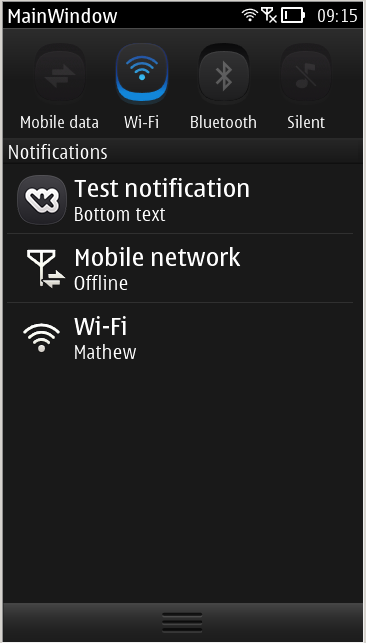

# PiglerPlugin
### by [shinovon](https://github.com/shinovon) and [curoviyxru](https://github.com/curoviyxru)
The indicator plugin implementation, currently avaliable for Symbian/Nokia Belle only, written in Symbian C++. 
The purpose of this plugin is to provide easy and open-source API that provides Symbian's notification features.

# Building
You will need Carbide.c++ v2.7, Qt SDK and Belle SDK for QT SDK 
Links: <a href="https://mrrosset.github.io/Symbian-Archive/Dep&IDE.html">Carbide</a>,  <a href="https://mrrosset.github.io/Symbian-Archive/SDKs-Langs.html">Qt SDK and Belle SDK</a>

Note: This guide does not show how to build java-library and java-tester

## Setting up carbide workspace
Open Preferences

Go to SDK Preferences, add new SDK

Specify the path of Belle SDK, fill in the fields as shown here

Then go to Qt, add Qt version and make it default

## Importing projects
Open context menu in Project Explorer, select "Import"

Import plugin & sym-library as Symbian OS Bld.inf file

Import qt-library & qt-tester as Qt Project

# Planned things:
* [x] Implement indicator icons and various images formats support
* [x] Find a workaround for missing indicators bug until any system indicator is shown on Symbian Belle
* [x] Implement tap handling/callbacking for indicators for native
* [x] Implement tap handling/callbacking for indicators for Java
* [x] Implement icon sending and resizing
* [x] Java JNI methods
* [x] Qt utility methods
* [x] Application launch on indicator tap
* [x] Do not open app on tap option
* [ ] Javadoc, API docs, building guides
* [ ] Implement a range of standard icons for notifications
* [ ] Reboot phone after package install and uninstall
* [ ] Show indicators on lock screen
* [ ] System vibration function
* [ ] Automatic package creation and installation with JNI library
* [ ] Notification permissions management
* [ ] Placeholder icon for notifications without icon
* [ ] Discreet popup show feature
* [ ] ~~Implement a plugin for status pane top indicators~~
* [ ] ~~Notifications saving to DB and load them on system start~~
* [ ] ~~System notification sound / beeping function~~
* [ ] ~~System notification light function~~
* [ ] ~~Research for workarounds for Symbian Anna and Symbian 9.4~~
* [ ] ~~Implement an TCP (or UDP?) server for J2ME and other technology-based apps~~
* [ ] ~~Icon color change depending on theme (as stated in docs)~~
